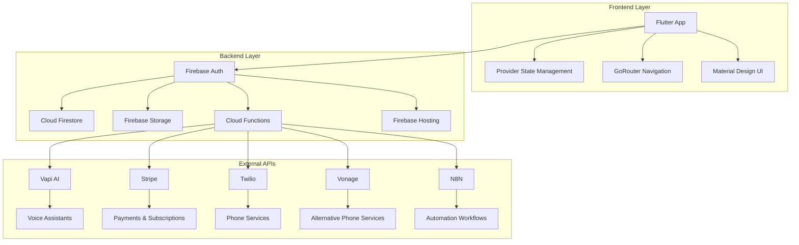
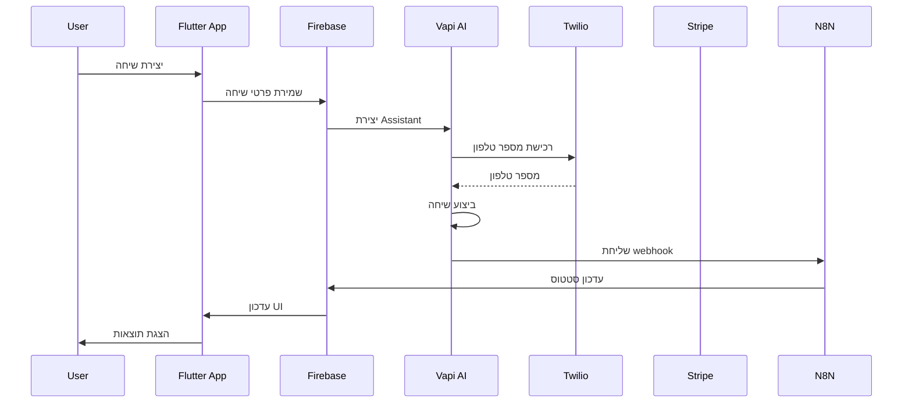

# VoiceFlow AI - ארכיטקטורה מפורטת ומערכת אינטגרציות

## סקירה כללית
VoiceFlow AI הוא פלטפורמה מתקדמת לניהול שיחות טלפון אוטומטיות מבוססת AI, הבנויה על Flutter עם backend Firebase. המערכת מספקת פתרון מקיף לניהול שיחות, ניהול לקוחות, תשלומים, וניהול משימות.

## ארכיטקטורה כללית



### Frontend (Flutter)
- **Framework**: Flutter עם תמיכה ב-Web, Android, iOS
- **State Management**: Provider pattern עם FFAppState
- **Navigation**: GoRouter עם routing דינמי
- **UI Components**: Material Design 3 עם תמיכה ב-Themes

### Backend (Firebase)
- **Authentication**: Firebase Auth עם תמיכה ב-Google, Apple, Email
- **Database**: Cloud Firestore עם real-time updates
- **Storage**: Firebase Storage לקבצים
- **Functions**: Cloud Functions לשרתים
- **Hosting**: Firebase Hosting

## אינטגרציות חיצוניות

### זרימת אינטגרציות


### 1. Vapi AI (אינטגרציה ראשית)
**תפקיד**: ניהול שיחות AI אוטומטיות
**API Base URL**: `https://api.vapi.ai`
**תכונות**:
- יצירת עוזרים וירטואליים (Assistants)
- ניהול מספרי טלפון
- ביצוע שיחות אוטומטיות
- ניהול כלים (Tools) לשיחות
- מעקב אחר שיחות

**פונקציות עיקריות**:
- `CreateAssitantCall` - יצירת עוזר AI חדש
- `CreatePhoneNumberCall` - רכישת מספר טלפון
- `PlaceCallCall` - ביצוע שיחה
- `GetAllAssistantsCall` - קבלת רשימת עוזרים
- `UpdateAssistantCall` - עדכון עוזר קיים

### 2. Stripe (תשלומים)
**תפקיד**: ניהול תשלומים ומנויים
**API Base URL**: `https://api.stripe.com/v1`
**תכונות**:
- יצירת לקוחות
- ניהול מנויים
- יצירת sessions לתשלום
- מעקב אחר חשבוניות
- ניהול אמצעי תשלום

**פונקציות עיקריות**:
- `CreateCustomerCall` - יצירת לקוח חדש
- `CreateSessionCall` - יצירת session לתשלום
- `ManageSubscriptionCall` - ניהול מנוי
- `GetInvoicesCall` - קבלת חשבוניות
- `GetPaymentMethodsCall` - ניהול אמצעי תשלום

### 3. Twilio (טלפוניה)
**תפקיד**: ניהול שירותי טלפוניה
**API Base URL**: `https://api.twilio.com/2010-04-01/Accounts/`
**תכונות**:
- חיפוש מספרי טלפון
- רכישת מספרי טלפון
- שליחת SMS
- ניהול שיחות

**פונקציות עיקריות**:
- `SearchNumberCall` - חיפוש מספרים זמינים
- `BuyPhoneNumberCall` - רכישת מספר טלפון
- `SendSmsCall` - שליחת הודעות SMS
- `UpdatePhoneNumberTwilioCall` - עדכון הגדרות מספר

### 4. Vonage (טלפוניה חלופית)
**תפקיד**: שירותי טלפוניה נוספים
**API Base URL**: `https://rest.nexmo.com/`
**תכונות**:
- חיפוש מספרי טלפון
- רכישת מספרים
- ניהול שירותי טלפוניה

**פונקציות עיקריות**:
- `BuyNumberVonageCall` - רכישת מספר
- `SearchNumverCall` - חיפוש מספרים

### 5. N8N (אוטומציה)
**תפקיד**: אוטומציה של תהליכים
**Webhook URLs**:
- `https://heliowicttor.app.n8n.cloud/webhook/9f03b4f3-7800-4b1b-84a4-8d52cc6bd1b8/call/`
- `https://n8n.sovanza.net/webhook/94b54353-1808-469a-8c8f-6cfadf32202c/voiceflow`

## מודל הנתונים (Data Models)

### Collections עיקריות

#### 1. Users Collection
```dart
class UserRecord {
  String? email;
  String? displayName;
  String? phoneNumber;
  String? company;
  Role? role;
  UserStatus? status;
  List<String>? permissions;
  String? stripeCustomerId;
  bool? subscribed;
  String? stripeSubscriptionId;
  String? stripeSubscriptionStatus;
}
```

#### 2. Companies Collection
```dart
class CompanyRecord {
  String? name;
  String? industry;
  String? address;
  String? phoneNumber;
  String? email;
  List<String>? serviceAreas;
}
```

#### 3. Jobs Collection
```dart
class JobsRecord {
  String? title;
  String? description;
  JobStatus? status;
  Priorty? priority;
  DateTime? scheduledDate;
  String? customerId;
  String? technicianId;
  String? companyId;
}
```

#### 4. Calls Collection
```dart
class CallRecord {
  String? customerName;
  String? customerPhone;
  String? assistantId;
  String? phoneNumberId;
  DateTime? startTime;
  DateTime? endTime;
  String? status;
  String? transcript;
  String? recordingUrl;
}
```

#### 5. Leads Collection
```dart
class LeadRecord {
  String? name;
  String? email;
  String? phone;
  String? company;
  String? industry;
  String? source;
  DateTime? createdAt;
  String? status;
  String? notes;
}
```

### Enums
```dart
enum JobStatus { Unassigned, Pending, Inprogress, Completed, Cancelled }
enum Role { admin, agent }
enum UserStatus { active, inactive }
enum Priorty { Low, High, Medium, Urgent }
enum CalendarViewType { timeline, weekly, monthly }
enum Labels { inbound_outbound, transfer }
```

## Firebase Cloud Functions

### 1. createAgent
**תפקיד**: יצירת משתמש חדש במערכת
**פונקציונליות**:
- יצירת משתמש ב-Firebase Auth
- שמירת פרטי משתמש ב-Firestore
- הגדרת הרשאות ותפקיד

### 2. sendMailToCustomer
**תפקיד**: שליחת אימיילים ללקוחות
**פונקציונליות**:
- הגדרת SMTP server
- שליחת אימיילים עם HTML
- ניהול credentials

### 3. stripeCustomerSubscription
**תפקיד**: ניהול webhooks של Stripe
**פונקציונליות**:
- עיבוד אירועי מנוי
- עדכון סטטוס משתמש
- ניהול תשלומים

## מבנה האפליקציה

### Pages Structure
```
lib/pages/
├── authentication/          # התחברות והרשמה
├── adminpannel/            # פאנל מנהל
├── agent/                  # ניהול סוכנים
├── billing/               # ניהול תשלומים
├── calls/                 # ניהול שיחות
├── dispatch/              # ניהול משימות
├── lead_management/       # ניהול לידים
├── professionals/         # ניהול מקצועיים
├── profile_management/    # ניהול פרופיל
└── components/           # רכיבים משותפים
```

### Backend Structure
```
lib/backend/
├── api_requests/         # API calls
├── firebase/            # Firebase configuration
├── firebase_storage/    # Storage management
├── schema/              # Data models
└── custom_cloud_functions/ # Custom functions
```

### Custom Code
```
lib/custom_code/
├── actions/             # Custom actions
└── widgets/            # Custom widgets
```

## תכונות עיקריות

### 1. ניהול שיחות
- יצירת עוזרים AI
- ניהול מספרי טלפון
- ביצוע שיחות אוטומטיות
- מעקב אחר שיחות
- הקלטות ותמלילים

### 2. ניהול לקוחות
- CRM מובנה
- ניהול לידים
- מעקב אחר לקוחות
- היסטוריית שיחות

### 3. ניהול משימות
- יצירת משימות
- הקצאת משימות
- מעקב אחר סטטוס
- לוח זמנים

### 4. ניהול תשלומים
- אינטגרציה עם Stripe
- ניהול מנויים
- מעקב אחר תשלומים
- חשבוניות

### 5. ניהול משתמשים
- מערכת הרשאות
- ניהול סוכנים
- מעקב אחר פעילות

## אבטחה

### Authentication
- Firebase Auth עם multiple providers
- JWT tokens
- Role-based access control

### Data Security
- Firestore security rules
- API key management
- Encrypted communications

### API Security
- Bearer token authentication
- Rate limiting
- Input validation

## Performance & Scalability

### Frontend
- Lazy loading של pages
- Image caching
- State management optimization

### Backend
- Firestore indexing
- Cloud Functions optimization
- CDN for static assets

## Monitoring & Analytics

### Firebase Analytics
- User behavior tracking
- Performance monitoring
- Error reporting

### Custom Analytics
- Call metrics
- User engagement
- Business metrics

## Deployment

### Development
- Firebase emulators
- Local development setup
- Testing environment

### Production
- Firebase hosting
- Cloud Functions deployment
- Database migration
- Security configuration

## תחזוקה ופיתוח

### Code Organization
- Modular architecture
- Separation of concerns
- Reusable components

### Testing
- Unit tests
- Integration tests
- E2E testing

### Documentation
- API documentation
- Code comments
- Architecture diagrams

## סיכום

VoiceFlow AI הוא מערכת מורכבת ומתקדמת המשלבת טכנולוגיות מודרניות לניהול שיחות AI אוטומטיות. הארכיטקטורה מבוססת על Flutter frontend עם Firebase backend, ומשלבת מספר אינטגרציות חיצוניות לספק פתרון מקיף לניהול שיחות, לקוחות, תשלומים ומשימות.

המערכת תומכת במספר פלטפורמות (Web, Mobile, Desktop) ומספקת ממשק משתמש אינטואיטיבי עם יכולות מתקדמות של AI לשיחות אוטומטיות.
